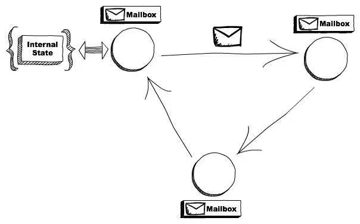
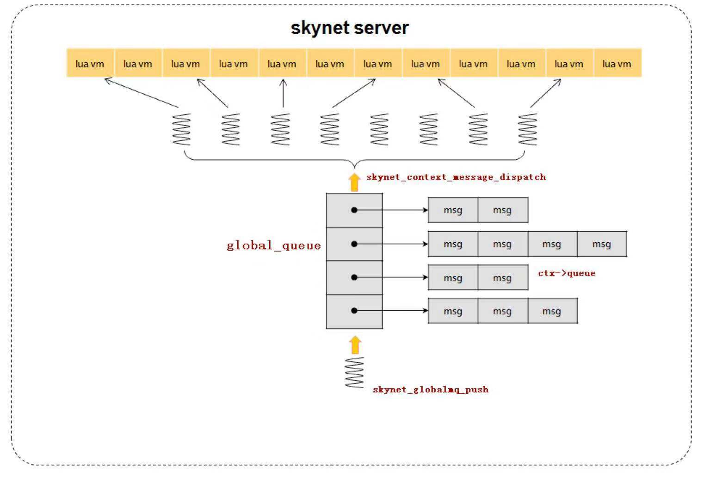

# skynet介绍

* skynet 是C+lua开发的服务端并发框架，采用单进程多线程Actor并发模型。

### actor并发模型介绍



>> 消息->行为->状态

>> actor模型通过定义组件动作和交互规则来处理并发逻辑。

>> actor是计算单元，接收消息并基执行对应的计算逻辑。

>> actors之间相互隔离，可维持私有状态，通过交换消息决定是否改变状态。

>> 分工产生效率，协作促进繁荣， 通过actor之间相互配合产生蚁群效应，以应对大规模并发问题。

### CSP(Communicating Sequential Processes)并发模型

>> 两个独立的并发实体通过共享的通讯 channel(管道)进行通信的并发模型。 


### 两个模型对比

* 共同的编程哲学：

>> Don’t communicate by sharing memory, share memory by communicating


* CSP中消息的交互是同步的，Actor中支持异步的消息交互

* CSP通过管道通信，上下游通过管道进行解耦，Actor通过信箱通信，需要对对方有所了解。


    
### skynet中的actor

每个服务就是一个actor，可以用c语音编写，也可以用lua编写。

#### 用c实现skynet服务：
1. 模块定义，实现接口create，init，signal和release,
2. 编译成so库
3. 调用该so库api的句柄，加载到modules列表
4. 用时调用

```c
// skynet_module.h
typedef void * (*skynet_dl_create)(void);
typedef int (*skynet_dl_init)(void * inst, struct skynet_context *, const char * parm);
typedef void (*skynet_dl_release)(void * inst);
typedef void (*skynet_dl_signal)(void * inst, int signal);
 
struct skynet_module {
	const char * name;          // C服务名称，一般是C服务的文件名
	void * module;              // 访问该so库的dl句柄，该句柄通过dlopen函数获得
	skynet_dl_create create;    // 绑定so库中的xxx_create函数，通过dlsym函数实现绑定，调用该create即是调用xxx_create
	skynet_dl_init init;        // 绑定so库中的xxx_init函数，调用该init即是调用xxx_init
	skynet_dl_release release;  // 绑定so库中的xxx_release函数，调用该release即是调用xxx_release
	skynet_dl_signal signal;    // 绑定so库中的xxx_signal函数，调用该signal即是调用xxx_signal
};
```

#### 用lua实现skynet服务：
1. 定义行为
2. 分发消息


```lua
local skynet = require "skynet"

-- 状态
local db = {}

-- 动作
local command = {}

function command.GET(key)
	return db[key]
end

function command.SET(key, value)
	local last = db[key]
	db[key] = value
	return last
end

-- 消息
skynet.start(function()
	skynet.dispatch("lua", function(session, address, cmd, ...)
		cmd = cmd:upper()
		local f = command[cmd]
		if f then
			skynet.ret(skynet.pack(f(...)))
		else
			error(string.format("Unknown command %s", tostring(cmd)))
		end
	end)
	skynet.register "SIMPLEDB"
end)
```

### skynet中的消息调度



二级消息队列, 类似golang的二级channel

消息处理过程：
1. global_mq 中pop出一个服务的次级队列
2. 从次级队列pop出一个消息
3. 调用对应服务对应的callback函数
4. 将次级队列push进global_mq


### skynet中的线程

1. monitor线程用于检测节点内的消息是否堵住
2. timer线程运行定时器
3. socket线程进行网络数据的收发
4. worker线程则负责对消息队列进行调度(上节所述)


### skynet目录结构
```text
/project/skynet
├── 3rd
├── cservice
├── examples
├── HISTORY.md
├── LICENSE
├── luaclib
├── lualib
├── lualib-src
├── Makefile
├── platform.mk
├── README.md
├── service
├── service-src
├── skynet
├── skynet-src
└── test
```

1. 3rd目录：提供lua语言支持、 jemalloc（内存管理模块）、md5加密等基础工具

2. skynet-src目录：包含skynet最核心机制的模块，包括逻辑入口、加载C服务代码的skynet_module模块、运行和管理服务实例的skynet_context模块、skynet消息队列、定时器和socket模块等。

3. service-src目录：这是依附于skynet核心模块的c服务，如用于日志输出的logger服务，用于运行lua脚本snlua的c服务等。

4. lualib-src目录：提供C层级的api调用，如调用socket模块的api，调用skynet消息发送，注册回调函数的api，甚至是对C服务的调用等，并导出lua接口，供lua层使用。可以视为lua调C的媒介

5. service目录：lua层服务，依附于snlua这个c服务，这个目录包含skynet lua层级的一些基本服务，比如启动lua层级服务的bootstrap服务，gate服务，供lua层创建新服务的launcher服务等。

6. lualib目录：包含调用lua服务的辅助函数，方便应用层调用skynet的一些基本服务；包含对一些c模块或lua模块调用的辅助函数，总之，这些lualib方便应用层调用skynet提供的基本服务，和其他库。
    
### skynet常用组件API

[Skynet GitHub APIList](https://github.com/cloudwu/skynet/wiki/APIList "Skynet GitHub APIList")

### 实现一个聊天服务器

```text
/project/skynet_chat_server
├── bin
├── chat_svr
├── config
├── lib
└── service
```

#### 目录规划：
1. lib下用来放通用代码 
2. service下用来放服务代码
3. xx_svr用来放各个独立的进程代码。
4. config用来放配置文件。bin下面用来放启动脚本

#### skynet网络服务三剑客：
1. gate 网关负责客户端连接和数据传输
2. watchdog 看门狗，负责唤醒后端其他服务
3. agent 客户端在服务端对应的代理，负责接收客户端消息，转发到后端服务


#### 聊天服务器源码简介
1. config/config.path 定义源码搜索路径，config/config_chat定义进程启动参数
2. main.lua 启动脚本，负责启动基本的服务，包括watchdog
3. service目录chat聊天服务，agent代理服务，watchdog看门狗服务，protoloader协议加载服务
4. lib/proto.lua 协议定义文件
5. 服务启动顺序chat, watchdog, gate, agent

* 服务端进程启动：
```bash
/project/skynet/skynet /project/skynet_chat_server/config/config_chat 
```

* 客户端命令行连接：
```bash
# 可以启动两个客户端 互相聊天
/project/skynet/3rd/lua/lua /project/skynet_chat_server/bin/client.lua
```

* 聊天：
```bash
query_msg # 查询历史聊天记录

send_msg xxxx # 发送一条聊天信息
```

### 总结
1. skynet框架只提供基础层代码，游戏业务层逻辑，游戏管理层工具还需要自己实现
2. skynet消息调度机制决定了其不擅长处理CPU密集的长作业
3. skynet将网关，代理，其他后端服务等actor，但运行在同一个进程中；如果一个玩法一个服务，很容易实现一个单服玩法都放在一起的游戏，或者区服概念比较弱的游戏类型。
4. 至于是单进程单服，还是单进程多服还需要使用者去取舍。
5. 跨服玩法可以采用skynet的集群方案。

### 参考链接：

[skynet源码地址](https://github.com/cloudwu/skynet)

[skynet设计综述](https://blog.codingnow.com/2012/09/the_design_of_skynet.html)

[聊天服务器源码地址](https://github.com/MaxwellBackend/Games)